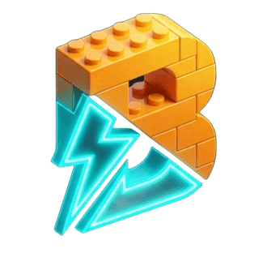

<div align="center">
  

# BlinkBlox

**An IDL compiler for Roblox buffer networking whose generated server is safe to point at the open internet.**

[](LICENSE)
[](https://github.com/XopoIII/BlinkBlox/releases/latest)
[](https://xopoiii.github.io/BlinkBlox/)

[Documentation](https://xopoiii.github.io/BlinkBlox/) ·
[Quick start](https://xopoiii.github.io/BlinkBlox/getting-started/quick-start/) ·
[Changelog](CHANGELOG.md)

</div>

You describe your events and functions, and what they carry, in a `.blink` schema. The compiler
generates a server module and a client module in plain Luau. They pack every call into one buffer
per frame, check everything a client sends before your code sees it, and keep working when a client
is hostile.

```blink
event Damage {
	From: Client,
	Type: Reliable,
	Call: SingleSync,
	Rate: 10,
	Data: struct { Target: Instance(Humanoid), Amount: u8(1..100) }
}
```

```luau
-- Server: the listener runs only after the rate limit has passed and Amount is 1..100.
Net.Damage.On(function(Player, Hit)
	Combat.Apply(Player, Hit.Target, Hit.Amount)
end)

-- Client
Net.Damage.Fire({ Target = Humanoid, Amount = 25 })
```

<div align="center">
  
</div>

## Why BlinkBlox

- **Bounded inbound traffic.** Packet size, the number of events in a packet and the number of
  instance references are capped before anything is parsed. Each player also gets a byte budget.
- **Rate limits per player and per event.** Set `Rate` and `Burst` on an event, or a default for
  the whole schema, and `Concurrency` on a function to bound the calls still running. Refused events
  go to a handler you provide, and nobody is kicked automatically.
- **Hostile input costs the attacker, not the server.** Every length is checked before the read and
  the allocation it pays for. A malformed event ends its packet without throwing: the events
  before it are delivered, and the failure goes to a handler you provide.
- **Mismatched builds refuse each other.** A client and a server built from different schemas stop
  at startup instead of decoding one event as another.
- **Small on the wire.** Booleans and optional flags share a bitfield, and `boolean[]` packs eight
  to a byte. A length is sent relative to its range, `CFrame<quat>` fits a rotation in 7 bytes, and
  `u24`, `i24` and `f24` fill the gap between 16 and 32 bits, so `vector<f24>` is 9 bytes instead of
  12. An unreliable event that cannot fit is refused at compile time.
- **Tooling.** The CLI has watch mode and `@profile` builds that keep debug remotes out of release,
  `--check --json` reports every diagnostic as JSON for editors and AI assistants, and `--verify`
  fails a pre-commit hook or CI step when the committed modules no longer match the schema. The generated
  modules pass their own `--!strict`. You also get TypeScript definitions and a Studio plugin with
  live diagnostics.

## Performance

Each tool fires 1000 events a frame from client to server. Blink is the original project BlinkBlox
forked from, at its last release, 0.18.9. The runs were made on an Apple M1, on BlinkBlox 0.36.2.

In Studio, the numbers are the median frame rate and the milliseconds a frame's thousand fires took.

| Payload | Roblox remotes | BlinkBlox | Blink | zap | ByteNet | Packet |
|---|---|---|---|---|---|---|
| 1000 booleans | 16 FPS, 29.2 ms | **60 FPS**\*, **4.2 ms** | 53 FPS, 8.4 ms | 35 FPS, 25.9 ms | 17 FPS, 41.3 ms | 15 FPS, 67.3 ms |
| 1000 booleans, each different | 16 FPS, 29.4 ms | **60 FPS**\*, **8.7 ms** | 36 FPS, 20.5 ms | 26 FPS, 34.4 ms | 15 FPS, 44.7 ms | 15 FPS, 77.5 ms |
| 100 entities | 16 FPS, 110.1 ms | **56 FPS**, **4.0 ms** | 22 FPS, 4.6 ms | 22 FPS, 20.5 ms | 18 FPS, 37.8 ms | 15 FPS, 50.3 ms |
| 100 entities, each different | 15 FPS, 115.6 ms | **51 FPS**, 5.1 ms | 22 FPS, **5.0 ms** | 22 FPS, 20.4 ms | 17 FPS, 38.3 ms | 15 FPS, 53.1 ms |

\* Studio caps the frame rate at 60.

On Lune, without Roblox, the numbers are the milliseconds a frame's thousand fires took
interpreted, as most players' clients run them, then the milliseconds the server took to decode
them natively, and the bytes one event takes before compression.

| Payload | BlinkBlox | Blink | zap | ByteNet | Packet |
|---|---|---|---|---|---|
| 1000 booleans | **38.2 / 4.4 ms, 128 B** | 68.8 / 12.1 ms, 1003 B | 174.0 / 13.4 ms, 1003 B | 126.6 / 122.2 ms, 1003 B | 124.8 / 116.1 ms, 1003 B |
| 100 entities | 33.5 / **12.6 ms**, 603 B | **33.4** / 73.3 ms, 603 B | 83.8 / 73.8 ms, 603 B | 109.1 / 111.4 ms, 603 B | 100.5 / 163.2 ms, 603 B |

The methodology, the bandwidth, the random payloads and the full percentiles are in
[Benchmarks](https://xopoiii.github.io/BlinkBlox/guides/benchmarks/) and
[`benchmark/Benchmarks.md`](benchmark/Benchmarks.md).

## Where it comes from

BlinkBlox is a maintained fork of [Blink](https://github.com/1Axen/blink). Upstream froze this line
of the compiler and began a rewrite. It left reported defects open, including an unbounded parse of
a hostile client buffer. This fork fixes them and continues from `v0.18.8`. See
[Migrating from Blink](https://xopoiii.github.io/BlinkBlox/guides/migrating-from-blink/).

## Install

```sh
rokit add XopoIII/BlinkBlox blinkblox             # CLI through Rokit
pesde add xopoiii/blinkblox --dev --target lune   # or through pesde
```

Binaries for every platform, and the Studio plugin (`blinkblox-plugin.rbxm`), are attached to each
[release](https://github.com/XopoIII/BlinkBlox/releases/latest). The plugin is also on the Creator
Store as **BlinkBlox Editor**. See [Installation](https://xopoiii.github.io/BlinkBlox/getting-started/installation/).

## Contributing

```sh
rokit install              # toolchain
sh scripts/run-tests.sh    # test suite
cd docs && npm install && npm run dev   # documentation site
```

`CLAUDE.md` describes the architecture and the gates that CI and the git hooks run.

<div align="center">
  
</div>

## Credits

Originally written by [Axen](https://github.com/1Axen). This fork continues from v0.18.8 and remains
MIT licensed.

- [Zap](https://zap.redblox.dev/), for the range and array syntax.
- [ArvidSilverlock](https://github.com/ArvidSilverlock), for the float16 implementation.
- The Studio plugin's autocomplete icons come from [Microsoft](https://github.com/microsoft/vscode-icons),
  under the [CC BY 4.0](https://github.com/microsoft/vscode-icons/blob/main/LICENSE) license.
- <a href="https://www.flaticon.com/free-icons/speed" title="speed icons">Speed icons created by alkhalifi design - Flaticon</a>
