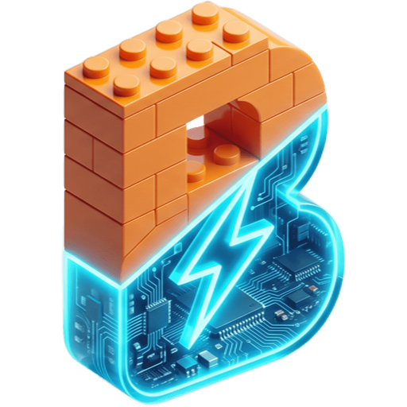

<div align="center">
  

# BlinkBlox

**An IDL compiler for Roblox buffer networking whose generated server is safe to point at the open internet.**

[](LICENSE)
[](https://github.com/XopoIII/BlinkBlox/releases/latest)
[](https://xopoiii.github.io/BlinkBlox/)

[Documentation](https://xopoiii.github.io/BlinkBlox/) ·
[Quick start](https://xopoiii.github.io/BlinkBlox/getting-started/quick-start/) ·
[Changelog](CHANGELOG.md)

</div>

You describe your events and functions, and what they carry, in a `.blink` schema. The compiler
generates a server module and a client module in plain Luau. They pack every call into one buffer
per frame, check everything a client sends before your code sees it, and keep working when a client
is hostile.

```blink
event Damage {
	From: Client,
	Type: Reliable,
	Call: SingleSync,
	Rate: 10,
	Data: struct { Target: Instance(Humanoid), Amount: u8(1..100) }
}
```

```luau
-- Server: the listener runs only after the rate limit has passed and Amount is 1..100.
Net.Damage.On(function(Player, Hit)
	Combat.Apply(Player, Hit.Target, Hit.Amount)
end)

-- Client
Net.Damage.Fire({ Target = Humanoid, Amount = 25 })
```

## Why BlinkBlox

- **Bounded inbound traffic.** Packet size, the number of events in a packet and the number of
  instance references are capped before anything is parsed. Each player also gets a byte budget.
- **Rate limits per player and per event.** Set `Rate` and `Burst` on an event, or a default for
  the whole schema, and `Concurrency` on a function to bound the calls still running. Refused events
  go to a handler you provide, and nobody is kicked automatically.
- **Hostile input costs the attacker, not the server.** Every length is checked before the read and
  the allocation it pays for. A malformed event ends its packet without throwing: the events
  before it are delivered, and the failure goes to a handler you provide.
- **Mismatched builds refuse each other.** A client and a server built from different schemas stop
  at startup instead of decoding one event as another.
- **Small on the wire.** Booleans, optional flags, enum values and tags share a bitfield, and
  `boolean[]` packs eight to a byte. A length is sent relative to its range, a short one in a single
  varint byte, `CFrame<quat>` fits a rotation in 7 bytes, and
  `u24`, `i24` and `f24` fill the gap between 16 and 32 bits, so `vector<f24>` is 9 bytes instead of
  12. A float with a step and a range is quantized: `f32<0.01>(-1..1)` is one byte. An unreliable event
  that cannot fit is refused at compile time.
- **Few remote calls.** A `FireAll` goes to every player in one `FireAllClients`, streams to
  everyone share one packet a frame, and `BatchUnreliable` gathers a frame's unreliable events the
  same way. A client cuts its batch to fit the server's limits, so an honest player is never refused,
  and sends at most 60 times a second, since every remote call costs about 11 bytes of its own.
- **An outbound budget.** Give each player a byte budget for what the server sends, and mark the
  events and streams that may wait with `Priority: Low`; nothing else is ever held back.
- **Tooling.** The CLI has watch mode and `@profile` builds that keep debug remotes out of release,
  `--check --json` reports every diagnostic as JSON for editors and AI assistants, and `--verify`
  fails a pre-commit hook or CI step when the committed modules no longer match the schema. The generated
  modules pass their own `--!strict`. You also get TypeScript definitions and a Studio plugin with
  live diagnostics.

## Performance

Each tool fires 1000 events a frame from client to server. Blink is the original project BlinkBlox
forked from, at its last release, 0.18.9. The runs were made on 2026-09-28 on an Intel Core
i7-13700K on BlinkBlox 0.41.2.

In Studio, the numbers are the median frame rate and the milliseconds a frame's thousand fires took.
Warp encodes later in the frame than it fires, so its frame rate is the figure to read.

| Tool | 1000 booleans | 1000 booleans, each different | 100 entities | 100 entities, each different |
|---|---|---|---|---|
| Roblox remotes | 15 FPS, 26.0 ms | 15 FPS, 29.1 ms | 15 FPS, 72.7 ms | 15 FPS, 74.5 ms |
| **BlinkBlox** | **60 FPS**\*, 1.9 ms | **60 FPS**\*, 4.8 ms | **60 FPS**\*, 2.0 ms | **60 FPS**\*, 2.4 ms |
| Blink | **60 FPS**\*, 4.5 ms | **60 FPS**\*, 9.9 ms | 44 FPS, 2.8 ms | 45 FPS, 3.2 ms |
| zap | **60 FPS**\*, 12.2 ms | 46 FPS, 18.1 ms | 45 FPS, 7.4 ms | 44 FPS, 7.8 ms |
| ByteNet | 30 FPS, 17.5 ms | 23 FPS, 21.4 ms | 35 FPS, 15.8 ms | 34 FPS, 16.6 ms |
| Packet | 35 FPS, 27.3 ms | 28 FPS, 31.8 ms | 27 FPS, 19.2 ms | 27 FPS, 19.9 ms |
| QuickNet | **60 FPS**\*, 1.9 ms | **60 FPS**\*, 7.1 ms | 58 FPS, 6.2 ms | 57 FPS, 6.7 ms |
| Warp | **60 FPS**\*, 0.1 ms | 55 FPS, 0.1 ms | 33 FPS, 0.1 ms | 32 FPS, 0.1 ms |

\* Studio caps the frame rate at 60.

On [LuneBlox](https://github.com/XopoIII/LuneBlox), without Roblox -- the Luau version and flags
Roblox runs -- on an Intel Core i7-13700K with BlinkBlox 0.41.2, each figure the median of three
runs. "Send" is a frame's thousand fires and the flush into a packet, interpreted, as most players'
clients run it; "decode" is the server decoding them, natively compiled, as a Roblox server runs
it; bytes are one event before compression.

| Tool | 1000 booleans: send / decode | 100 entities: send / decode | Bytes, booleans / entities |
|---|---|---|---|
| **BlinkBlox** | **17.2** / 6.5 ms | **12.9** / **7.3 ms** | **128** / **602** |
| Blink | 30.9 / 11.0 ms | 13.1 / 25.4 ms | 1003 / 603 |
| zap | 70.4 / 8.6 ms | 35.6 / 25.6 ms | 1003 / 603 |
| ByteNet | 58.6 / 51.1 ms | 45.5 / 46.3 ms | 1003 / 603 |
| Packet | 58.2 / 51.6 ms | 43.1 / 58.5 ms | 1003 / 603 |
| QuickNet | 18.2 / **4.1 ms** | 23.7 / 12.6 ms | **128** / 603 |
| Warp | 41.4 / 9.0 ms | 71.1 / 29.8 ms | **128** / **602** |

A game also sends the other way. Natively, with fifty players, send then decode, medians of five
runs:

| Tool | 100 structs a frame to everyone, `FireAll` | 8 unreliable inputs a frame |
|---|---|---|
| **BlinkBlox** | **0.020 / 0.016 ms, 1 remote call** | **0.002 / 0.002 ms, 1 remote call** with [`BatchUnreliable`](https://xopoiii.github.io/BlinkBlox/language/options/#batchunreliable) |
| Blink | 0.955 / 0.027 ms, 50 calls | 0.002 / 0.003 ms, 8 calls |
| zap | 1.010 / 0.026 ms, 50 calls | 0.003 / 0.002 ms, 8 calls |
| ByteNet | 0.049 / 0.108 ms, 1 call | 0.003 / 0.008 ms, 1 call |
| Packet | 0.089 / 0.185 ms, 1 call | no unreliable channel |
| QuickNet | 0.334 / 0.040 ms, 50 calls | 0.002 / 0.003 ms, 1 call |
| Warp | 2.569 / 0.125 ms, 50 calls | 0.004 / 0.008 ms, 1 call |

A client receiving 100 events a frame spread over 128 declarations decodes them in 0.013 ms
natively and 0.025 ms interpreted: the event an index names is found by halving the range rather
than one comparison after another.

The methodology, the bandwidth, the random payloads, streams and the full percentiles are in
[Benchmarks](https://xopoiii.github.io/BlinkBlox/guides/benchmarks/) and
[`benchmark/Benchmarks.md`](benchmark/Benchmarks.md). What 0.41.0 changed is in
[What's new in 0.41](https://xopoiii.github.io/BlinkBlox/guides/whats-new/).

## Where it comes from

BlinkBlox is a maintained fork of [Blink](https://github.com/1Axen/blink). Upstream froze this line
of the compiler and began a rewrite. It left reported defects open, including an unbounded parse of
a hostile client buffer. This fork fixes them and continues from `v0.18.8`. See
[Migrating from Blink](https://xopoiii.github.io/BlinkBlox/guides/migrating-from-blink/).

## Install

```sh
rokit add XopoIII/BlinkBlox blinkblox             # CLI through Rokit
pesde add xopoiii/blinkblox --dev --target lune   # or through pesde
```

Binaries for every platform, and the Studio plugin (`blinkblox-plugin.rbxm`), are attached to each
[release](https://github.com/XopoIII/BlinkBlox/releases/latest). The plugin is also on the Creator
Store as **BlinkBlox Editor**. See [Installation](https://xopoiii.github.io/BlinkBlox/getting-started/installation/).

## Contributing

```sh
rokit install              # toolchain
sh scripts/run-tests.sh    # test suite
cd docs && npm install && npm run dev   # documentation site
```

`CLAUDE.md` describes the architecture and the gates that CI and the git hooks run.

## Credits

Originally written by [Axen](https://github.com/1Axen). This fork continues from v0.18.8 and remains
MIT licensed.

- [Zap](https://zap.redblox.dev/), for the range and array syntax.
- [ArvidSilverlock](https://github.com/ArvidSilverlock), for the float16 implementation.
- The Studio plugin's autocomplete icons come from [Microsoft](https://github.com/microsoft/vscode-icons),
  under the [CC BY 4.0](https://github.com/microsoft/vscode-icons/blob/main/LICENSE) license.
- <a href="https://www.flaticon.com/free-icons/speed" title="speed icons">Speed icons created by alkhalifi design - Flaticon</a>
